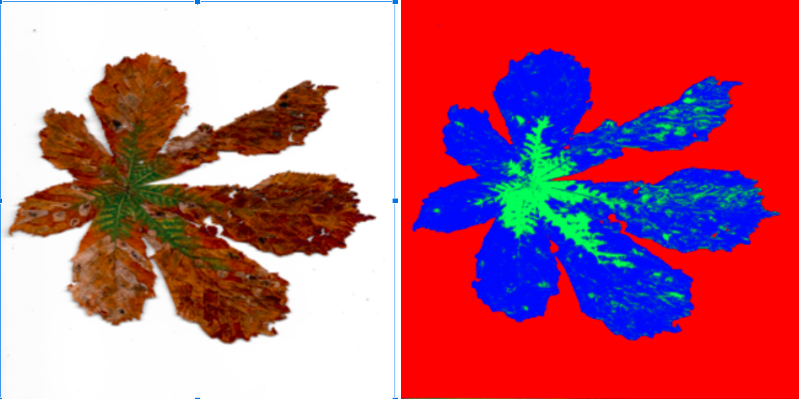

# Summary
This repository contains code for the identification of healthy and rooted regions of the horse chestnut leaf images. The implemented algorithm assigns one of rotten healthy or background classes to each of the image pixels independently. A sample algorithm result is shown in the picture below.

# Algorithm description
For each pixel, it calculates distances to each of predefined colors.
For simplicity, it is implemented using K-means algorithm, but we only use K-means algorithm to calculate distances. We do not use k-means algorithm to determine cluster centers.

# Files content
- analyze_leafs.ipynb: main notebook for reading the images from your directory, predicting pixel classes, displaying the results and generate the notebook with statistics about each leaf.
- leaf_constants.py: Algorithm constants
colors: Base colors are specified here. Distances of pixel colors to each of these colors in RGB space is calculated and pixel classes is determined based on to which of base colors it is closest.
group_colors_to_display: colors by which the pixels groups are displayed
base_images_dir: dir where source images are stored
image_size_cm: size of image in squared centimeters
- N_green_classes: Determines to how many classes is order of roothing splited
leaf_utils.py: Main functions
calculate_pixel_classes: Pixel classes are determined in this function.
calculate_image_statistics: Calculate image statistics 

# How to use

If you want to use the provided code for your own purposes, create conda enviroment from yaml file, set constants in the leaf_constants.py file and you are ready to use. If you are new to python, you may follow following instructions:
- Install Anaconda (see e.g. this video)
- Open Anaconda Powershell Prompt and change directory to where you want to have your files and code which analyze them. (use command cd your_dir_path)
- Download this repository. Use git clone … or simply download all files from this repository to your local directory.
- Create Anaconda env in from yaml file (see e.g. this video) type jupyter notebook to your conda power shell and you should be ready to use

# Excel with leaf's statistics
Function calculate_image_statistics calculates statistics which are than exported to the excel file. Excel has the following columns
- filename: str: name of file
- green_ratio: float from [0, 1] - what part of leaf is assigned green class
- leaf_ratio: float from [0, 1] - what part of image is leaf (i.e. pixels which are not background)
- leaf_area_cm: Area of leaf in cm^2
